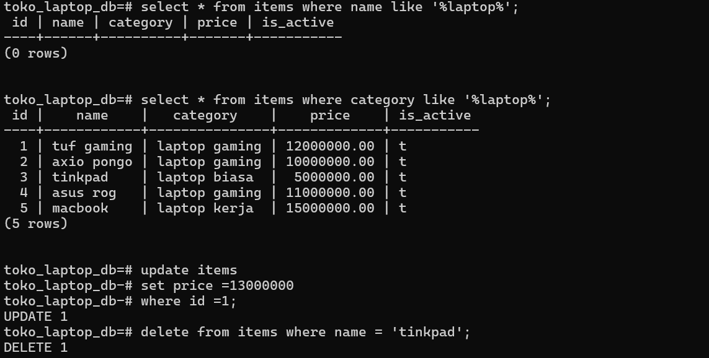

5. Kuis Pilihan Ganda (Latihan)

1.Apa kepanjangan dari SQL?  b. Structured Query Language 

2. Manakah yang termasuk database Relasional (SQL)? c. PostgreSQL 

3. Perintah untuk mengambil data dari tabel adalah... c. SELECT

4. Tipe data yang paling tepat untuk menyimpan harga barang agar presisi adalah...  c. DECIMAL 

5. Apa fungsi PRIMARY KEY pada sebuah tabel?  b. Sebagai pengenal unik setiap baris data 

6. Query untuk menampilkan data produk yang stoknya habis (0) adalah... a. SELECT * FROM products WHERE stock = 0; 

7. Perintah ORDER BY price DESC artinya...  b. Urutkan harga dari termahal ke termurah 

8. Apa yang terjadi jika kita menjalankan DELETE FROM products; tanpa WHERE?  c. Semua data di tabel products akan terhapus 

9. Untuk mengubah data yang sudah ada, kita menggunakan perintah... c. UPDATE 

10. Tipe data VARCHAR(50) artinya...  b. Teks maksimal 50 karakter 